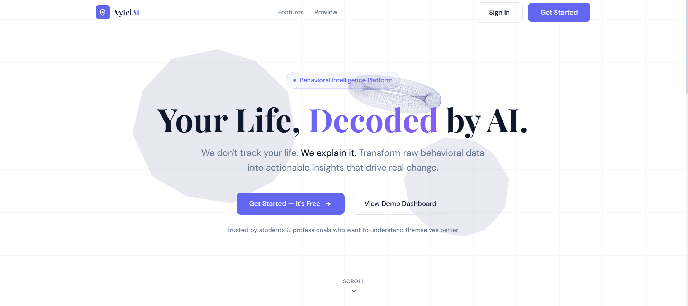
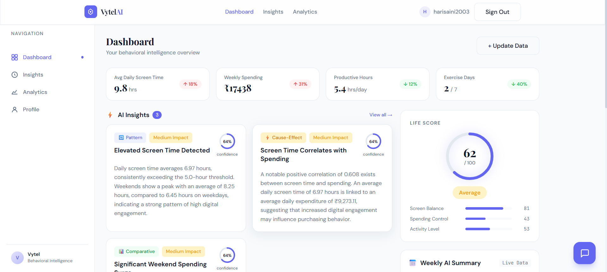
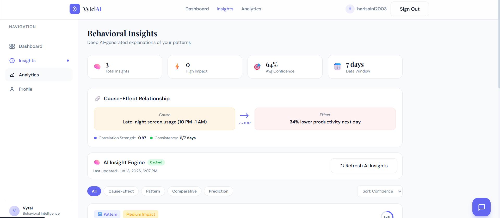
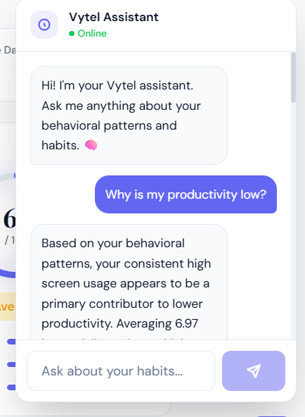
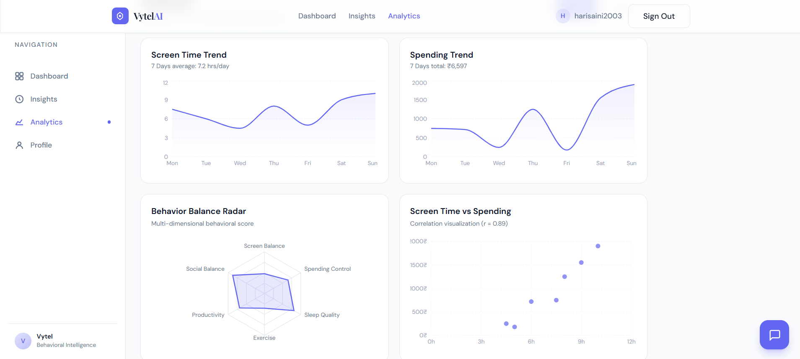

# 🧠 Vytel – Behavioral Intelligence & Analytics Platform 

> **"We don't just track behavior. We explain it."**

Vytel is an AI-powered behavioral intelligence platform that transforms raw behavioral data into meaningful, actionable insights using machine learning, predictive analytics, and conversational AI.

It analyzes:

* screen time
* spending habits
* activity patterns
* productivity behavior

and converts them into:

* behavioral insights
* life score analytics
* predictive trends
* AI-powered recommendations
* conversational intelligence

---

# 🚀 Preview


## 🏠 Landing Page

```md

```

---

## 📊 Dashboard

```md

```

---

## 🧠 Insights Page

```md

```

---

## 💬 AI Chat Assistant

```md

```

---

## 📈 Analytics Page

```md

```

---

# ✨ Core Features

## 🧠 Behavioral Intelligence Engine

* AI-generated behavioral insights
* Pattern detection and clustering
* Correlation and relationship analysis
* Predictive analytics engine
* Dynamic life score generation
* Cause-effect behavioral mapping

---

## 💬 Conversational AI Assistant

* Gemini-powered chatbot
* Conversational memory
* Persistent chat history
* Context-aware responses
* Behavioral recommendation engine
* Personalized AI coaching

---

## ⚡ AI Optimization Architecture

* Gemini batch generation
* Smart frontend caching
* Intelligent AI lifecycle management
* Timestamp-based refresh logic
* Manual AI regeneration
* Reduced API quota consumption
* Fallback AI resilience system

---

## 📊 Analytics & Visualization

* Behavioral heatmaps
* Spending analytics
* Screen-time trends
* Productivity tracking
* Weekly summaries
* Insight confidence scores
* Interactive charts and graphs

---

# 🏗 Architecture Overview

```text
Raw Behavioral Data
        ↓
Pattern Detection Engine
        ↓
Relationship & Correlation Analysis
        ↓
Prediction Engine
        ↓
AI Insight Generation
        ↓
Conversational AI Assistant
        ↓
Frontend Lifecycle & Smart Caching
```

---

# 🧠 AI Pipeline

## 1️⃣ Pattern Detection

Behavioral data is analyzed using clustering and aggregation techniques to detect:

* repetitive usage habits
* activity peaks
* behavioral cycles
* productivity trends

---

## 2️⃣ Relationship Analysis

The system detects correlations between:

* screen usage
* spending habits
* productivity
* exercise consistency
* sleep-related behavior

using statistical analysis and rule-based intelligence.

---

## 3️⃣ Prediction Engine

Behavioral forecasting predicts:

* future screen trends
* spending spikes
* productivity decline
* habit consistency

using regression-based analysis.

---

## 4️⃣ AI Insight Generation

Structured behavioral findings are transformed into:

* human-readable insights
* recommendations
* explanations
* AI summaries

using Gemini AI.

---

## 5️⃣ Conversational Intelligence

The chatbot uses:

* behavioral context
* recent conversations
* insight memory
* activity patterns

for intelligent multi-turn conversations.

---

# ⚙️ Tech Stack

| Layer            | Technology                         |
| ---------------- | ---------------------------------- |
| Frontend         | React + Vite                       |
| Styling          | Tailwind CSS                       |
| Animations       | Framer Motion                      |
| Charts           | Recharts                           |
| Backend          | FastAPI                            |
| Database         | MongoDB                            |
| AI Model         | Gemini 2.5 Flash                   |
| ML & Analytics   | Scikit-learn, Pandas, NumPy, SciPy |
| Authentication   | JWT + bcrypt                       |
| State Management | React Context API                  |

---

# 📁 Project Structure

```text
vytel/
├── frontend/
│   ├── src/
│   │   ├── components/
│   │   ├── pages/
│   │   ├── context/
│   │   └── App.jsx
│   ├── package.json
│   └── vite.config.js
│
├── backend/
│   ├── app/
│   │   ├── routes/
│   │   ├── services/
│   │   ├── models/
│   │   ├── main.py
│   │   └── database.py
│   ├── requirements.txt
│   └── .env
│
├── output/
│   ├── landing.png
│   ├── dashboard.png
│   ├── insights.png
│   ├── chatbot.png
│   └── analytics.png
│
└── README.md
```

---

# 🚀 Setup Instructions

## 1️⃣ Clone Repository

```bash
git clone https://github.com/your-username/vytel.git
cd vytel
```

---

# 🖥 Backend Setup

## 2️⃣ Create Virtual Environment

```bash
cd backend
python -m venv venv
```

---

## 3️⃣ Activate Virtual Environment

### Windows

```bash
venv\Scripts\activate
```

### Mac/Linux

```bash
source venv/bin/activate
```

---

## 4️⃣ Install Dependencies

```bash
pip install -r requirements.txt
```

---

## 5️⃣ Create `.env`

```env
MONGODB_URL=your_mongodb_url
SECRET_KEY=your_secret_key
ALGORITHM=HS256
ACCESS_TOKEN_EXPIRE_MINUTES=1440
GEMINI_API_KEY=your_gemini_api_key
```

---

## 6️⃣ Run Backend

```bash
uvicorn app.main:app --reload --port 8000
```

---

# 🌐 Frontend Setup

## 7️⃣ Install Frontend Dependencies

```bash
cd frontend
npm install
```

---

## 8️⃣ Create Frontend `.env`

```env
VITE_API_URL=http://localhost:8000
```

---

## 9️⃣ Run Frontend

```bash
npm run dev
```

---

# 🧪 Testing Flow

1. Create account/login
2. Load sample behavioral data
3. Generate AI insights
4. Explore dashboard analytics
5. Use AI chatbot
6. Test insight refresh system
7. Analyze behavioral predictions

---

# ⚡ AI Lifecycle System

Vytel uses an optimized AI lifecycle architecture.

## 🔄 Smart AI Flow

```text
Frontend Cache
        ↓
Smart Validation
        ↓
Gemini Batch Generation
        ↓
Persistent Insight State
        ↓
Manual Refresh System
```

---

## ✅ Optimization Features

* intelligent caching
* reduced Gemini usage
* smart invalidation
* manual regeneration
* conversational memory
* AI fallback system
* optimized request batching

---

# 💬 Conversational AI Features

The Vytel assistant supports:

* multi-turn conversations
* behavioral memory
* context persistence
* personalized recommendations
* insight-aware prompting

---

# 🔒 Privacy & Data Handling

* User data is never sold.
* Behavioral analytics remain user-focused.
* AI requests use structured summaries rather than raw sensitive data.
* Local caching minimizes unnecessary AI requests.

---

# 🚧 Current Development Phase

## 🎨 Product Refinement & UX Polish

Current focus areas:

* dashboard decluttering
* premium UI improvements
* responsiveness
* animations & transitions
* insight-centric navigation
* improved visual hierarchy
* advanced loaders & interactions

---

# 🚀 Future Scope

## 🌐 Production Deployment

* Vercel frontend deployment
* Render/Railway backend deployment
* production infrastructure
* cloud-scale optimization

---

## 🧠 Advanced AI Expansion

* Ollama local AI integration
* hybrid AI architecture
* offline AI mode
* cross-device persistence
* distributed AI caching
* advanced behavioral forecasting

---

# 📄 API Documentation

After running backend:

```text
http://localhost:8000/docs
```

Swagger UI provides:

* endpoint testing
* request schemas
* API exploration

---


# 📜 License

This project is developed for educational, research, and portfolio purposes.

---

# 🧠 Vytel

> "Behavior becomes intelligence when patterns become understandable."
